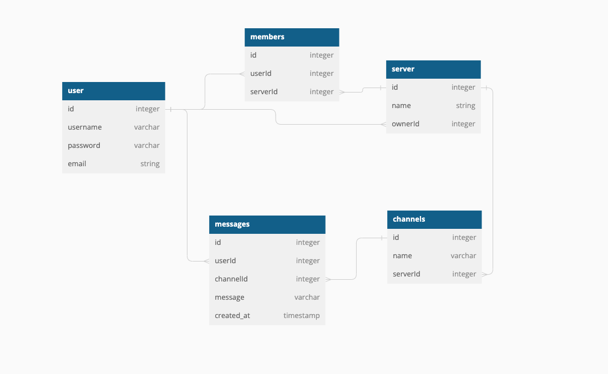

User:
| column name	    | data type | details                 |   |   |
|----------------|-----------|-------------------------|---|---|
| id             | Integer   | Not null, primary key,  |   |   |
| username       | String    | Not null                |   |   |
| hashedPassword | String    | Not null                |   |   |
| email          | String    | Not null                |   |   |

Messages:
| column name	 | data type | details                 |   |   |
|-------------|-----------|-------------------------|---|---|
| id          | Integer   | Not null, primary key,  |   |   |
| userId      | Integer   | Not null                |   |   |
| channelId   | Integer   | Not null                |   |   |
| message     | String    | Not null                |   |   |
| created_at  | timestamp | Not null                |   |   |

userId references the User table
channelId references the Channel table

Server:
| column name	 | data type | details                 |   |   |
|-------------|-----------|-------------------------|---|---|
| id          | Integer   | Not null, primary key,  |   |   |
| name        | String    | Not null                |   |   |
| ownerId     | Integer   | Not null                |   |   |
| message     | String    | Not null                |   |   |

ownerId references the User table

Channel:
| column name	 | data type | details                 |   |   |
|-------------|-----------|-------------------------|---|---|
| id          | Integer   | Not null, primary key,  |   |   |
| name        | String    | Not null                |   |   |
| serverId    | Integer   | Not null                |   |   |
| message     | String    | Not null                |   |   |

serverId references the Server table

Members:
| column name	 | data type | details                 |   |   |
|-------------|-----------|-------------------------|---|---|
| id          | Integer   | Not null, primary key,  |   |   |
| userId      | Integer   | Not null                |   |   |
| serverId    | Integer   | Not null                |   |   |
| message     | String    | Not null                |   |   |

userId references the User table
serverId references the Server table

